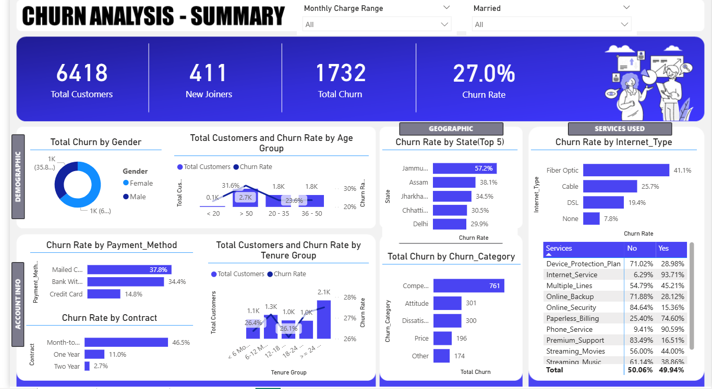
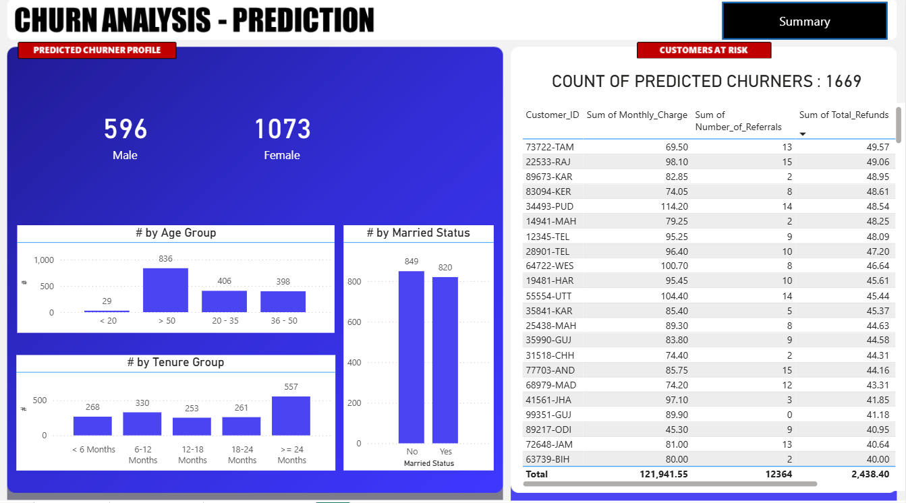

#  Churn Analysis Project

##  Overview
This project focuses on analyzing customer churn and predicting potential churners using SQL Server, Power BI, and Machine Learning.

## Tech Stack
- SQL Server → ETL & Data Cleaning
- Power BI → Data Visualization & Dashboard
- Python → Machine Learning (Random Forest)

##  Project Workflow
1. Data Extraction & ETL using SQL Server
2. Data Cleaning & Preparation
3. Data Transformation in Power BI
4. Interactive Dashboard Creation
5. Building a Random Forest Model in Python
6. Predicting Customer Churn

##  Dashboard Preview

##  Machine Learning Model
- Algorithm: Random Forest
- Goal: Predict customer churn
- Output: List of high-risk customers

## Key Insights
- Identified patterns leading to customer churn
- Highlighted high-risk customer segments
- Provided actionable insights for retention

## Project Structure
- `/sql` → SQL scripts 
- `/powerbi` → Power BI dashboard
- `/python` → ML model 
- `/images` → Screenshots

## Results
- Built an end-to-end churn analysis solution
- Enabled data-driven decision making
- 
##  Machine Learning Results

### Model Performance
- Accuracy: 84%
- Precision (Churn): 78%
- Recall (Churn): 65%
- F1-Score (Churn): 71%

### Confusion Matrix

### Classification Report
The model shows good performance in predicting non-churn customers, while churn prediction can be further improved.

### Insights
- Model performs well on majority class (non-churn)
- Some churn customers are missed (recall can be improved)
- Useful for identifying high-risk customers
